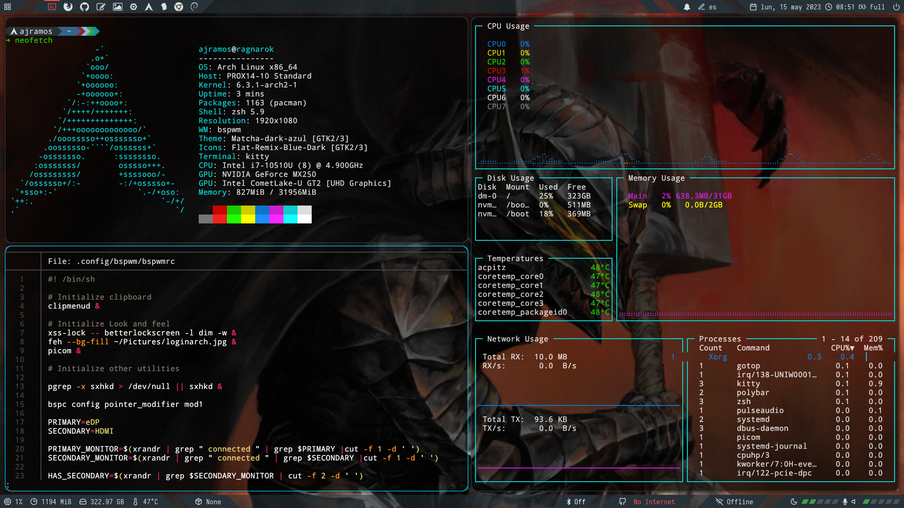

# Archlinux at Slimbook

This document constitutes a compilation of my learnings during Arch Linux
Installation &amp; Configuration in my [Slimbook](https://www.slimbook.com) ProX14.

Following you can find the specs of the setup (excerpt from inxi command):
```bash
Machine:
  Type: Laptop System: SLIMBOOK product: PROX14-10 
Memory:
  RAM: total: 31.22 GiB used: 883.6 MiB (2.8%) 
CPU:
  Info: Quad Core model: Intel Core i7-10510U bits: 64 type: MT MCP arch: Kaby Lake 
Graphics:
  Device-1: Intel UHD Graphics 
  Device-2: NVIDIA GP108M [GeForce MX250] 
  Device-3: Chicony HD Webcam type: USB 
Audio:
  Device-1: Intel Comet Lake PCH-LP cAVS vendor: Tongfang Hongkong Limited 
Network:
  Device-1: Intel Comet Lake PCH-LP CNVi WiFi
  Device-2: Realtek RTL8111/8168/8411 PCI Express Gigabit Ethernet 
Bluetooth:
  Device-1: Intel Bluetooth 9460/9560 Jefferson Peak (JfP) 
Drives:
  ID-1: Samsung model: SSD 970 EVO Plus 500GB 
Battery:
  ID-1: 46.7 Wh
```

Most of the content has been extracted from the [Arch Wiki](https://wiki.archlinux.org/)
which is the best linux learning tool ever.

The document is divided in two parts:
1. Installation of a plain vanilla Arch Linux
2. Configuration and customization for a development oriented user

The starting point was a single boot with Slimbook OS (modified Ubuntu 20.04) 
preinstalled.

**DISCLAIMER**: I am not a linux expert, with this guide I am trying to put together all
the learnings I made a long the way, I hope to save some time in the future not only for
me in a potential reinstallation situation but for other people who are in the same 
situation as me which basically it is a strong desire for becoming knowledgeable in 
the linux world, I adjusted this setup balancing my taste, time and comprenhension of the
subsystems and modules, probably there are better ways to do these configurations, go out 
there and find yours because that is the beauty of the open source software.

**Good Luck!**



# 1. Installation of a plain vanilla Arch Linux

This procedure includes the root partition encryption (using LUKS without LVM)

## 0. Fetch the latest Arch linux iso to a USB flash memory

In linux you can use the following:
```bash
dd if=/path/to/iso of=/dev/sdX
```
where sdX is the device representing your usb key.

## 1. Load Spanish keyboard layout, connect to internet and adjust clock:

```bash
loadkeys es
iwctl station wlan0 connect "MiWifi"
timedatectl set-ntp true
```

## 2. Load additional kernel modules for encryption

```bash
modprobe dm-crypt
modprobe dm-mod
```

## 3. Create the partitions, we are going to need three of them:

| Partition | Size | Type | Mount point | Comments |
| --------- | ---- | ---- | ----------- | -------- |
| EFI | 256MB | EFI Partition | /boot/efi | You can keep the default one if you had Slimbook OS pre-installed |
| Boot | 512MB | ext4 | /boot | - |
| Root | ∞ | ext4 | / | The rest of your hard drive |

Please use the tool you feel the most comfortable with, in my case I used fdisk

```bash
fdisk /dev/nvme0n1
```

If everything goes fine you should see something like this:


## 4. Encrypt root partition 

You will be requested to confirm with a YES (in uppercase) and then set a password

```bash
cryptsetup luksFormat -v -s 512 -h sha512 /dev/nvme0n1p3
cryptsetup open /dev/nvme0n1p3 luks_root
```

## 5. Format partitions

```bash
mkfs.vfat -n “EFI System” /dev/nvme0n1p1
mkfs.ext4 -L boot /dev/nvme0n1p2
mkfs.ext4 -L root /dev/mapper/luks_root
```

## 6. Mount partitions

Be careful to execute the commands in the proper order so that directories
are created in the proper partitions

```bash
mount /dev/mapper/luks_root /mnt
mkdir /mnt/boot
mount /dev/nvme0n1p2 /mnt/boot
mkdir /mnt/boot/efi
mount /dev/nvme0n1p1 /mnt/boot/efi
```

## 7. Swap file

Only if you are planning to hibernate the laptop to the hard drive.

Change the parameter count to set the amount of swap you would want.

```bash
cd /mnt
dd if=/dev/zero of=swap bs=1M count=2048
mkswap swap
swapon swap
chmod 0600 swap
```

## 8. Install base system and some minor utils

I am using neovim and Network Manager but feel free to install some other
editor or network utilities. 

```bash
pacstrap -i /mnt base base-devel efibootmgr grub linux linux-firmware \
 networkmanager sudo vim bash-completion neovim man-db iproute2 \
intel-ucode udev
```

## 9. Generate fstab file

```bash
genfstab -U /mnt >> /mnt/etc/fstab
```

## 10. Ch-root in your new system:

```bash
arch-chroot /mnt
```

## 11. Add a new user

Create a new user, this user will be the one to operate the system (via sudo) as 
I am not using the root user

```bash
useradd -m -s /bin/bash your_user_name
passwd your_user_name
```

## 12. Setup sudo

Execute the following line to edit the config with vim:
```bash
EDITOR=/usr/bin/vim visudo
```

Add the following line after the "root" user one
```bash
ajramos ALL=(ALL) ALL
```

Config your default visudo editor by adding the following line to the sudo config file:
```bash
Defaults editor=/usr/bin/nvim
```

## 13. Setup locale configuration
- Change Region by a valid one (e.g. Europe) as well as the City (e.g. Madrid)
```bash
ln -sf /usr/share/zoneinfo/Region/City /etc/localtime
hwclock --systohc
```

- Edit and uncomment by removing the '#' at the beginning of your locale configuration in my case Spanish (in my case es_ES.UTF-8) then run:
```bash
locale-gen
```

- Add language support:
```bash
echo "LANG=es_ES.UTF-8" > /etc/locale.conf
echo "KEYMAP=es" > /etc/vconsole.conf
```

## 14. Setup network
- Set your hostname
```bash
echo "your-host-name" > /etc/hostname
```

- Set your /etc/hosts file adding
```bash
127.0.0.1 localhost
::1 localhost
127.0.1.1 your-host-name.localdomain your-host-name
```
## 15. Setup grub

- Modify the following line in file /etc/default/grub so it looks like the following:
```bash
GRUB_CMDLINE_LINUX=”cryptdevice=/dev/nvme0n1p3:luks_root”
```

- Add "encrypt" module at the line starting with HOOKS
between block and filesystem at the /etc/mkinitcpio.conf
```bash
HOOKS=(base udev autodetect modconf block encrypt filesystems keyboard fsck)
```
Then execute the following command to re-create the kernel config:
```bash
mkinitcpio -p linux
```

## 16. Install and config grub
```bash
grub-install --boot-directory=/boot --efi-directory=/boot/efi /dev/nvme0n1p2
grub-mkconfig -o /boot/grub/grub.cfg
grub-mkconfig -o /boot/efi/EFI/arch/grub.cfg
```

## 17. Reboot
You are ready to go, exit from the chroot and reboot:
```bash
exit 
reboot
```

## 18. First boot

You will need to introduce the password for the encrypted partition (the one in the step 4. above)

Introduce your user's credentials

You can get online with the Network Manager, either by using nmtui or nmcli using, you should start it first

```bash
sudo systemctl start NetworkManager
nmcli station wifi connect "MiWifi"
```
Where "MiWifi" is the name of your SSID

After that enable NetworkManager
```bash
sudo systemctl enable NetworkManager
```

# 2. Configuration and customization  

After the arch installation it is time to start customizing the system for your
taste.

The selection of the tools has been very vim-oriented and trying to be as much
agnostic to any major Desktop Environment (such us Gnome, KDE, etc.)

In my case, I performed the customization in the following domains:

- Installation of a **pacman wrapper** to be able to handle easily official packages as
well the ones included in AUR. In my case I chose yay because its simplicity and
because it's been developed in Golang. See installation details in yay target within
the Makefile.

- Installation of the **graphical environment** and some related utilities. My stack
in this case is:
  - XServer
  - Nvidia proprietary driver and its utilities
  - Light Desktop Manager with Slick Greeter
  - Bspwm as a tiled window manager
  - Sxhkd as a key stroke handler
  - Rofi as a launcher
  - Polybar as a status bar
  - Dunst as a notification manager
  - Picom as composer
  - Pulseaudio as the audio system
  - Betterlockscreen as screenlocker
  - Blueman, and NetworkManager for handling BT and Network respectively

- For the **daily task activities** I am using:
  - Kitty as terminal, plus Oh-my-zsh and Startship as enhancements
  - Neovim as editor with a bunch of plugins such as (airline, vim-go, and others)
  - pqiv as image viewer
  - ranger and pcmanfm for file management
  - zathura as pdf reader
  - scrot as screenshooter
  - GVFS for Virtual filesystem (enables Trash bin, remote filesystem access, etc.)
  - CUPS for the printer config
  - Sane for the scanner config
  - Tmux as screen multiplexer
  - Only office as ofimatics suite
  - Firefox as main browser, although I have also installed Chromium

- For the **theme** I am using:
  - GTK Theme: Matcha
  - Icons: Flat remix
  - Cursor: Bibata

- **Development tools** (other than nvim): Visual Studio Code, Robo3T, Postman, MongoDB Compass,
Portainer, Go-Swagger, Go, Github CLI and git.

- **Cloud environment** and k8s toolkit: Google cloud SDK, Kubectx, kubens, dive, popeye
helm, linkerd, velero, and the beautiful k9s

- For **media** utilities: gimp, kazam, handbrake, vlc

- For **social** interaction: Slack, Cawbird (twitter) and Telegram

All the installation and configuration of these utilities can be seen in the proper targets
in the Makefile, usually there is one target for installation and another one (*-config)
for configuration.

Last but not the least, I also include within this repository my dotfiles for the
fine tuning of those tools as I have it today.

Hope you find this information useful.

**Happy hacking!**


*NOTES: about install printer service and drivers*

After install cups-pdf it must be enabled with, the restart will allow to access
to the [CUPS Web Admin](http://localhost:631)
```
sudo systemctl enable cups
sudo systemctl restart cups
sudo systemctl status systemd-resolved #Check it is disabled
sudo systemctl enable avahi-daemon
```
Finally modify the file /etc/nsswitch.conf adding "mdns_minimal [NOTFOUND=return]":
before the "resolve" statement in the "hosts" line, after doing so, restart
avahi-daemon:
```
hosts: ... mdns_minimal [NOTFOUND=return] resolve [!UNAVAIL=return] dns ...
```
You should be able to list the services within your network by running:
```
avahi-browse --all --ignore-local --resolve --terminate

```
You can also use bssh and bvnc for looking for SSH and VNC Servers.

Add your user group to the statement "SystemGroup" in the file 
/etc/cups/cups-files.conf
```
SystemGroup sys root wheel ajramos
```

# References

All this installation and setup couldn't have been possible without the help 
of the following links and guides, my biggest thanks for them.

- [0] [Arch Installation Guide](https://wiki.archlinux.org/title/Installation_guide)
- [1] [Arch Install With Full Disk Encryption](https://medium.com/hacker-toolbelt/arch-install-with-full-disk-encryption-6192e9635281)
- [2] [NVIDIA in Arch Linux](https://wiki.archlinux.org/title/NVIDIA)
- [3] [NVIDIA Optimus ](https://wiki.archlinux.org/title/NVIDIA_Optimus)
- [4] [NVIDIA Prime render](https://wiki.archlinux.org/title/PRIME#PRIME_render_offload)
- [5] [PRIME Render Offload](https://download.nvidia.com/XFree86/Linux-x86_64/440.44/README/primerenderoffload.html)
- [6] [Offloading Graphics Display with RandR 1.4](https://download.nvidia.com/XFree86/Linux-x86_64/440.44/README/randr14.html)
- [7] [UDev](https://wiki.archlinux.org/title/Udev)
- [8] [Bspwm](https://wiki.archlinux.org/title/Bspwm)
- [9] [Printer Config - CUPS](https://wiki.archlinux.org/title/CUPS)
- [10] [Scanner Config - SANE](https://wiki.archlinux.org/title/SANE)
- [11] [PCManFM](https://wiki.archlinux.org/title/PCManFM)
- [12] [File Manager Utility](https://wiki.archlinux.org/title/File_manager_functionality)
- [13] [Ranger User Guide](https://github.com/ranger/ranger/wiki/Official-user-guide)
- [14] [Polybar Themes](https://github.com/adi1090x/polybar-themes)
- [15] [Dunst](https://wiki.archlinux.org/title/Dunst)
- [16] [Dunst Module for Polybar](https://github.com/JeanEdouardKevin/dunst-polybar)
- [17] [Samba](https://wiki.archlinux.org/title/Samba#Accessing_shares)
