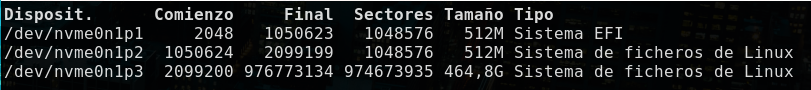

# Archlinux at Slimbook
This document constitutes a compilation of my learnings during Arch Linux
Installation &amp; Configuration in my (Slimbook)[https://www.slimbook.com] ProX14.

Most of the content has been extracted from the (Arch Wiki)[https://wiki.archlinux.org/]
which is the best linux learning tool ever.

The document is divided in two parts:
1. Installation of a plain vanilla Arch Linux
2. Configuration and customization for a development oriented user

The starting point was a single boot with Slimbook OS (modified Ubuntu 20.04) 
preinstalled.

**DISCLAIMER**: I am not a linux expert, with this guide I am trying to put together all
the learnings I made a long the way, hoping to save some time in the future not only for
me in a pontential reinstallation situation but for other people who are in the same 
situation as me which basically it is a strong desire for becoming knowledgeable in 
the linux world, I adjusted this setup balancing my taste, time and comprenhension of the
subsystems and modules, probably there are better ways to do these configurations, go out 
there and find yours because that is the beauty of the open source software.


Good Luck!

## 1. Installation of a plain vanilla Arch Linux

This procedure includes the root partition encryption (using LUKS without LVM)

### 0. Fetch the latest Arch linux iso to a USB flash memory
In linux you can use the following:
```bash
dd if=/path/to/iso of=/dev/sdX
```
where sdX is the device representing your usb key.


### 1. Load Spanish keyboard layout, connect to internet and adjust clock:
```bash
loadkeys es
iwctl station wlan0 connect "MiWifi"
timedatectl set-ntp true
```

### 2. Load additional kernel modules for encryption
```bash
modprobe dm-crypt
modprobe dm-mod
```

### 3. Create the partitions, we are going to need three of them:

| Partition | Size | Type | Mount point | Comments |
| --------- | ---- | ---- | ----------- | -------- |
| EFI | 256MB | EFI Partition | /boot/efi | You can keep the default one if you had Slimbook OS pre-installed |
| Boot | 512MB | ext4 | /boot | - |
| Root | ∞ | ext4 | / | The rest of your hard drive |

Please use the tool you feel the most comfortable with, in my case I used fdisk

```bash
fdisk /dev/nvme0n1
```

If everything goes fine you should see something like this:



### 4. Encrypt root partition 
You will be requested to confirm with a YES (in uppercase) and then set a password

```bash
cryptsetup luksFormat -v -s 512 -h sha512 /dev/nvme0n1p3
cryptsetup open /dev/nvme0n1p3 luks_root
```

### 5. Format partitions
```bash
mkfs.vfat -n “EFI System” /dev/nvme0n1p1
mkfs.ext4 -L boot /dev/nvme0n1p2
mkfs.ext4 -L root /dev/mapper/luks_root
```

### 6. Mount partitions

Be careful to execute the commands in the proper order so that directories
are created in the proper partitions

```bash
mount /dev/mapper/luks_root /mnt
mkdir /mnt/boot
mount /dev/nvme0n1p2 /mnt/boot
mkdir /mnt/boot/efi
mount /dev/nvme0n1p1 /mnt/boot/efi
```

### 7. Swap file

Only if you are planning to hibernate the laptop to the hard drive.

Change the parameter count to set the amount of swap you would want.

```bash
cd /mnt
dd if=/dev/zero of=swap bs=1M count=2048
mkswap swap
swapon swap
chmod 0600 swap
```

### 8. Install base system and some minor utils

I am using neovim and Network Manager but feel free to install some other
editor or network utilities. 

```bash
pacstrap -i /mnt base base-devel efibootmgr grub linux linux-firmware \
 networkmanager sudo vim bash-completion neovim man-db iproute2 \
intel-ucode udev
```

### 9. Generate fstab file
```bash
genfstab -U /mnt >> /mnt/etc/fstab
```

### 10. Ch-root in your new system:

```bash
arch-chroot /mnt
```

### 11. Add a new user

Create a new user, this user will be the one to operate the system (via sudo) as 
I am not creating using the root user
```bash
useradd -m -s /bin/bash your_user_name
passwd your_user_name
```

### 12. Setup sudo

Execute the following line to edit the config with vim:
```bash
EDITOR=/usr/bin/vim visudo
```

Add the following line after the "root" user one
```bash
ajramos ALL=(ALL) ALL
```
Config your default visudo editor by adding the following line to the sudo config file:
```bash
Defaults editor=/usr/bin/nvim
```

### 13. Setup locale configuration
- Change Region by a valid one (e.g. Europe) as well as the City (e.g. Madrid)
```bash
ln -sf /usr/share/zoneinfo/Region/City /etc/localtime
hwclock --systohc
```

- Edit and uncomment by removing the '#' at the beginning of your locale configuration in my case Spanish (in my case es_ES.UTF-8) then run:
```bash
locale-gen
```

- Add language support:
```bash
echo "LANG=es_ES.UTF-8" > /etc/locale.conf
echo "KEYMAP=es" > /etc/vconsole.conf
```

### 14. Setup network
- Set your hostname
```bash
echo "your-host-name" > /etc/hostname
```

- Set your /etc/hosts file adding
```bash
127.0.0.1 localhost
::1 localhost
127.0.1.1 your-host-name.localdomain your-host-name
```
### 15. Setup grub

- Modify the following line in file /etc/default/grub so it looks like the following:
```bash
GRUB_CMDLINE_LINUX=”cryptdevice=/dev/nvme0n1p3:luks_root”
```

- Add "encrypt" module at the line starting with HOOKS
between block and filesystem at the /etc/mkinitcpio.conf
```bash
HOOKS=(base udev autodetect modconf block encrypt filesystems keyboard fsck)
```
Then execute the following command to re-create the kernel config:
```bash
mkinitcpio -p linux
```

### 16. Install and config grub
```bash
grub-install --boot-directory=/boot --efi-directory=/boot/efi /dev/nvme0n1p2
grub-mkconfig -o /boot/grub/grub.cfg
grub-mkconfig -o /boot/efi/EFI/arch/grub.cfg
```

### 17. Reboot
You are ready to go, exit from the chroot and reboot:
```bash
exit 
reboot
```

### 18. First boot

You will need to introduce the password for the encrypted partition (the one in the step 4. above)

Introduce your users credentials

You can get online with the Network Manager, either by using nmtui or nmcli using, you should start it first

```bash
sudo systemctl start NetworkManager
nmcli station wifi connect "MiWifi"
```
Where "MiWifi" is the name of your SSID

After that enable NetworkManager
```bash
sudo systemctl enable NetworkManager
```

# 2. Customization (TODO)

After a plain arch installation install the following:

## Install yay
```
sudo pacman --needed git base-devel
cd /opt
sudo git clone https:/aur.archlinux.org/yay-git.git
sudo chown -R ajramos:ajramos ./yay-git
cd yay-git 
makepkg -si
```

## Install xserver
```
yay -S xorg-server xorg-xinit xterm xorg-xclock xrandr xorg-xprop xorg-apps
```

## Install graphic card drivers (watch arch linux Xorg installation guide)
```
yay -S xf86-video-intel
```

## Install bspwm and sxhkd
```
yay -S bspwm sxhkd 
```
In order to know the keyboard code for a specific key execute the following
```
xev -event keyboard
```
In order to know the name of a specific windows run the following command and 
click on the proper window:
```
xprop | grep WM_CLASS
```

## Install launcher and panel (and some other tweak tools)
```
yay -S picom feh nitrogen tilix polybar rofi dunst libnotify
```

## Install fonts (for polybar) 
```
yay -S fontconfig siji xorg-xfg xorg-fonts-misc ttf-iosevka-term noto-fonts-emoji 
```

## Install other utils
```
yay -S ranger nnn mc pywal pcmanfm tmux neovim which htop gotop powertop
yay -S usbutils iotop xarchiver jq yad libinput-gestures gimp
yay -S clipmenu scrot xbacklight xfce4-power-manager pqiv gparted
yay -S zathura zathura-cb zathura-djvu zathura-pdf-poppler \
zathura-ps vlc
yay -S remmina kazam handbrake notion-app pdfmixtool onlyoffice transmission-gtk
```

## Install Trash can compatibility and device,network and google automount
```
yay -S udisks2 gvfs gvfs-smb 
```

## Install screensaver & screen locker
```
yay -S betterlockscreen i3-lock imagemagick xorg-xdpyinfo
betterlockscreen -u ~/Pictures/city.jpg
```

## Install internet utils
```
yay -S firefox elinks lynx curl chromium neomutt bmon wget nm-connection-editor
yay -S youtube-dl
```

## Install audio system
```
yay -S alsa-utils pulseaudio pulseaudio-alsa
```

## Install oh-my-zsh
```
yay -S zsh
sh -c "$(curl -fsSL https://raw.github.com/ohmyzsh/ohmyzsh/master/tools/install.sh)"
```
## Install cloud utils
```
yay -S google-cloud-sdk kubens kubectx k9s dive velero linkerd popeye
gcloud auth login
gcloud config set project $PROJECT_NAME
```

## Vim Plugins
```
yay -S vim-plug python-pip ctags
touch $HOME/.vim/plugins.vim
python3 -m pip install --user --upgrade pynvim
nvim +PlugInstall
nvim +GoInstallBinaries
```

## Look & Feel customization
```
yay -S matcha-gtk-theme lxappearance-gtk3 flat-remix bibata-cursor-theme
```

## Polybar personalization
If this is the first time and you want to restart config at .config/polybar
otherwise, it is not required.

Also be aware you probable will need to check the modules initialization,
for example for battery, brightness, and so on, please follow instructions
within the config files. 
```
git clone --depth=1 https://github.com/adi1090x/polybar-themes.git
cd polybar-themes
chmod +x setup.sh
./setup.sh
```

## Rofi customization
```
git clone --depth 1 https://github.com/adi1090x/rofi.git
cd rofi
chmod +x setup.sh
./setup.sh
echo "export PATH=$HOME/.config/rofi/bin:$PATH" >> ~/.zshrc
```

## Display Manager
```
yay -S lightdm lightdm-gtk-greeter lightdm-slick-greeter
sudo systemctl enable lightdm
```

## Development tools
```
yay -S github-cli code hugo go2 robo3t-bin postman-bin mongodb-compass
portainer go-swagger
```

## Install Printer service and drivers
```
yay -S cups cups-pdf foomatic-db-ppds avahi nss-mdns system-config-printer
```
After install cups-pdf it must be enabled with, the restart will allow to access
to the [CUPS Web Admin](http://localhost:631)
```
sudo systemctl enable cups
sudo systemctl restart cups
sudo systemctl status systemd-resolved #Check it is disabled
sudo systemctl enable avahi-daemon
```
Finally modify the file /etc/nsswitch.conf adding "mdns_minimal [NOTFOUND=return]":
before the "resolve" statement in the "hosts" line, after doing so, restart
avahi-daemon:
```
hosts: ... mdns_minimal [NOTFOUND=return] resolve [!UNAVAIL=return] dns ...
```
You should be able to list the services within your network by running:
```
avahi-browse --all --ignore-local --resolve --terminate

```
You can also use bssh and bvnc for looking for SSH and VNC Servers.

Add your user group to the statement "SystemGroup" in the file 
/etc/cups/cups-files.conf
```
SystemGroup sys root wheel ajramos
```

## Install Scanner
```
yay -S sane-airscan simple-scan
```

## Install Collaboration and SNS
```
yay -S slack-desktop telegram-desktop cawbird
```

## Prompt customization with starship
```
sh -c "$(curl -fsSL https://starship.rs/install.sh)"
```

## References

All this installation and setup couldn't have been possible without the help 
of the following links and guides, my biggest thanks for them.